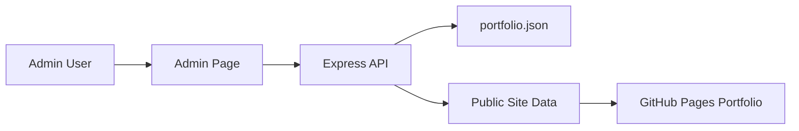

# Portfolio Admin App

This is the private admin tool for managing the content shown on the static portfolio website.

## Purpose

The admin app lets you update:
- brand and site text
- hero section content
- profile information
- summary and contact details
- skills
- experience timeline
- portfolio stats

## Tech stack

- Node.js
- Express.js
- JSON file storage

## Quick start

```bash
npm install
npm start
```

Then open:

```text
http://localhost:3000/admin
```

## Project structure

```text
node-admin-app/
├── data/
│   └── portfolio.json
├── public/
│   └── admin.html
├── server.js
├── package.json
├── .env.example
└── README.md
```

## Architecture



## Installation

From this folder:

```bash
npm install
```

## Environment variables

Create a `.env` file or set the variable in your hosting platform:

```bash
ADMIN_PASSWORD=Arnold@123
PORT=3000
```

## Run locally

```bash
npm start
```

Then open:

```text
http://localhost:3000/admin
```

## API endpoints

### Get portfolio data

```text
GET /api/portfolio
```

### Save portfolio data

```text
POST /api/portfolio
```

Body:

```json
{
  "password": "Arnold@123",
  "data": {
    "site": {},
    "hero": {},
    "profile": {},
    "stats": [],
    "summary": {},
    "skills": [],
    "contact": {},
    "experience": []
  }
}
```

## Deployment

Deploy this app on Render or another private hosting service. Keep the admin URL private and do not expose the admin password in static public files.

### Render deployment steps

1. Sign in to Render.
2. Click "New" and choose "Web Service".
3. Connect the GitHub repository that contains this app.
4. Select the repository and branch.
5. Use the following build command:

```bash
npm install
```

6. Use the following start command:

```bash
npm start
```

7. Add the environment variable:

```bash
ADMIN_PASSWORD=Arnold@123
PORT=3000
```

8. Click Deploy.
9. Copy the public Render URL and open `/admin` on that domain.

## Troubleshooting

### Render deploy fails

- Check the build command: `npm install`
- Check the start command: `npm start`
- Look at Render logs for missing dependencies or runtime errors.
- Confirm the app is connected to the correct repository.

### Admin page loads without password

- Verify the admin page is served by the private app and not as a local static file.
- Confirm the password guard script is active in the admin page.
- Clear browser cache if an old version is still being served.

### Password not accepted

- Confirm the environment variable is set exactly as `ADMIN_PASSWORD`.
- Redeploy the service after changing the value.
- Test the private admin URL directly and avoid the GitHub Pages site for admin access.

## Security note

The public portfolio is hosted on GitHub Pages, while this admin app should remain on a private server. The public site should not contain the admin password in client-side code.
