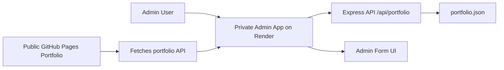

# Portfolio Admin App

This is the private admin backend for the static GitHub Pages portfolio. It handles authentication, stores the portfolio JSON, and serves the admin editing form.

## Purpose

The app lets you manage the public portfolio content from a secure private dashboard, including:

- site identity and branding
- hero section text
- profile details and GitHub link
- summary and contact info
- stats cards
- skills list
- experience timeline
- save/update workflow for the public site

## Tech stack

- Node.js
- Express.js
- JSON file storage
- Optional deployment on Render

## Project structure

```text
node-admin-app/
├── data/
│   └── portfolio.json
├── public/
│   └── admin.html
├── server.js
├── package.json
├── .env.example
├── README.md
└── .gitignore
```

## Architecture



The public portfolio site is static and hosted on GitHub Pages. It fetches the latest data from the private Render app instead of storing content locally.

## Quick start

From this folder:

```bash
npm install
npm start
```

Then open:

```text
http://localhost:3000/admin
```

## Environment variables

Create a `.env` file or set the values in Render / your hosting provider:

```bash
ADMIN_PASSWORD=Arnold@123
PORT=3000
ALLOWED_ORIGIN=https://amans-2201.github.io
```

### Notes

- `ADMIN_PASSWORD` is the password used by the admin login.
- `ALLOWED_ORIGIN` allows the GitHub Pages site to fetch data from the Render API.
- If `ALLOWED_ORIGIN` is omitted, the app falls back to the default GitHub Pages origin.

## API endpoints

### GET portfolio data

```text
GET /api/portfolio
```

Returns the current portfolio JSON for the public site.

### POST update portfolio data

```text
POST /api/portfolio
```

Request body:

```json
{
  "password": "Arnold@123",
  "data": {
    "site": {},
    "hero": {},
    "profile": {},
    "stats": [],
    "summary": {},
    "skills": [],
    "contact": {},
    "experience": []
  }
}
```

The server validates the password before writing to `data/portfolio.json`.

## Admin login behavior

- The admin dashboard is served from the private app, not GitHub Pages.
- The password is injected into the admin page from the server.
- The page stores authentication in browser session storage.
- The admin form loads existing data from `/api/portfolio`.
- After a successful save, the admin page redirects back to the public portfolio URL.

## Local development

Run the app locally:

```bash
npm start
```

Then access:

```text
http://localhost:3000/admin
```

## Render deployment

### Steps

1. Push this folder to GitHub.
2. Log in to Render.
3. Create a new Web Service.
4. Connect the repository.
5. Set the build command:

```bash
npm install
```

6. Set the start command:

```bash
npm start
```

7. Add environment variables:

```bash
ADMIN_PASSWORD=Arnold@123
PORT=3000
ALLOWED_ORIGIN=https://amans-2201.github.io
```

8. Deploy the service.
9. Open the Render URL + `/admin` to access the private admin portal.

## CORS and public site sync

The public static portfolio is hosted on GitHub Pages, but it fetches live content from the Render admin API. For this to work, the Render app must allow the GitHub Pages origin via CORS headers.

This is why `ALLOWED_ORIGIN` is required in production.

## Troubleshooting

### Public page still shows old content

- Redeploy the Render app after editing server code or env vars.
- Confirm the public site is fetching from the live Render URL.
- Check browser console for CORS errors.
- Confirm `ALLOWED_ORIGIN` matches the GitHub Pages URL exactly.

### Admin page shows a password prompt repeatedly

- Confirm `ADMIN_PASSWORD` is set correctly in Render.
- Clear session storage in the browser and retry.
- Restart the Render service after changing the environment variable.

### Save request fails

- Confirm the admin page is running from the private app URL.
- Check the Render logs for errors.
- Verify the JSON payload contains a valid `data` object.

### Render deploy fails

- Check the build command is `npm install`.
- Check the start command is `npm start`.
- Verify dependencies are installed correctly.
- Review Render logs for runtime errors.

## Security note

This app must stay on a private host. The public portfolio must never contain the admin password or sensitive admin logic. The static GitHub Pages site is only the consumer of the saved portfolio data.

## Important deployment principle

The source of truth for the portfolio content is the private JSON file on the admin app server. The GitHub Pages portfolio is a static frontend that reads from the live API and renders the latest data after save.
